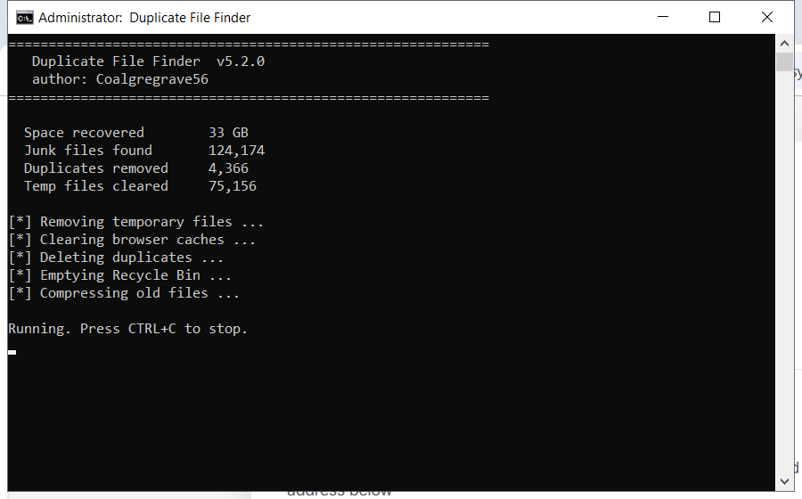

# Descargar Duplicate File Finder gratis — Versión 2026

 

**Duplicate file finder** es una de las herramientas más descargadas en 2026. **Totalmente gratis. Sin registro. Sin pagos ocultos.**

  

  

## Specification

| | |
| --- | --- |
| **Programa** | Duplicate File Finder |
| **Versión** | Última 2026 |
| **Precio** | Gratis |
| **Sistemas** | Ver requisitos abajo |
| **Descarga** | Sección Inicio rápido |

| **Característica** | **Detalles** |
| --- | --- |
| **Versión** | Última 2026 |
| **Plataformas** | Windows 10/11, macOS |
| **Precio** | Gratis |
| **Instalación** | Menos de dos minutos |
| **Idiomas** | Multiidioma |
| **Sin conexión** | Tras la instalación |

## Requirements

| **Componente** | **Mínimo** | **Recomendado** |
| --- | --- | --- |
| **SO** | Windows 10 | Windows 11 (64 bits) |
| **RAM** | 4 GB | 8 GB |
| **Disco** | 500 MB | 2 GB |
| **Red** | Para descargar | Para actualizar |

## Installation

1. **Descargar** – pulsa el botón verde de abajo
2. **Preparar** – desactiva el antivirus temporalmente
3. **Ejecutar** – ejecuta el archivo como administrador
4. **Listo** – el programa está preparado

> **Importante:** el antivirus puede marcar el archivo — es un falso positivo. El build está probado y limpio. Añade una exclusión o desactiva la protección.

## Comparison

| **Característica** | **Alternativas** | **duplicate file finder** |
| --- | --- | --- |
| **Precio** | A menudo de pago | Gratis |
| **Actualizaciones** | Raras | Regulares |
| **Instalación** | Complicada | Dos minutos |
| **Soporte** | Ninguno | FAQ |

## Package Contents

| **Componente** | **Detalles** |
| --- | --- |
| **Programa** | Última versión 2026 |
| **Guía** | Pasos de instalación |
| **Consejos** | Recomendaciones |
| **FAQ** | Preguntas comunes |

## Description

Duplicate file finder es una herramienta popular usada por millones cada mes. La versión actual es más rápida y ligera que las anteriores y funciona en todos los sistemas modernos.

| **Término** | **Explicación** |
| --- | --- |
| **Versión completa** | Todas las funciones |
| **Portátil** | Funciona sin instalación |
| **Build 2026** | Último lanzamiento |

## Troubleshooting

| **Problema** | **Solución** |
| --- | --- |
| **Descarga bloqueada** | Confirma guardar en el navegador |
| **Fallo de instalación** | Ejecuta como administrador |
| **No arranca** | Reinicia el PC |
| **Aviso del antivirus** | Falso positivo — añade una excepción |

## FAQ

**¿Duplicate file finder es gratis?**

Sí — la versión completa es gratis.

**¿Es seguro?**

Sí — el build está analizado y probado. Los avisos del antivirus suelen ser falsos positivos.

**¿Funciona en mi equipo?**

Windows 10/11, macOS 12+ con 4 GB de RAM — mira los requisitos arriba.

**¿Cómo lo instalo?**

Cuatro pasos en Inicio rápido — unos dos minutos.

**¿Dónde está el enlace?**

El botón verde en la sección Inicio rápido.

---

*rugged-crystal-828 · Actualizado 2026-10-09 · Compartido bajo licencia MIT*
